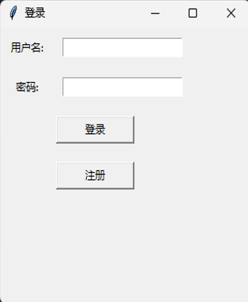
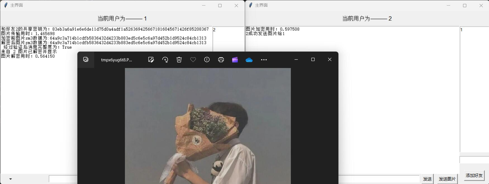
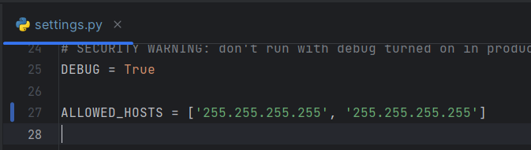
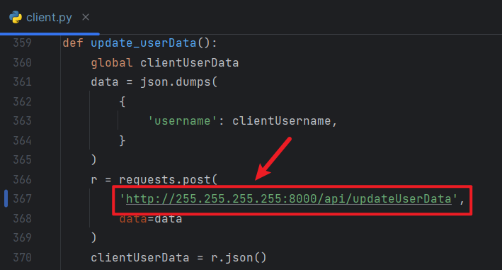
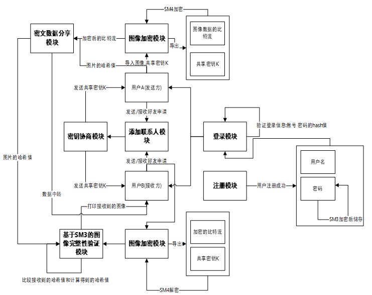

# 基于国密算法的图像加密系统设计与实现

效果展示：

主要功能：

+ 登录注册功能
+ 添加好友功能
+ 图片和比特相互转换功能
+ Diffe—Hellman密钥共享功能
+ SM3、SM4加密功能
+ 数据传输功能

## 如何直接使用此项目

此项目用的是python语言，python版本是3.11，编译器用的PyCharm专业版（因为需要使用Django框架来作为服务器），**<u>如果想使用 vscode 运行此项目，需要注意 vscode 不能用 PyCharm 同样的方法来读取项目中的文件，会对某些import导入报错，但是实际上在此项目中是有相关文件的，还有一些其他的python库需要自行导入</u>**

项目可以在多台电脑上进行，但需要在 ./密码学课设/setting.py 文件中，添加所有需要测试的电脑IP（如下图所示）

关于服务器的接口处理，所有函数都写在 ./APP/view.py 文件中，可以自行查看（客户端进行操作后所有内容均会通过这个文件里面的函数传递给服务端）

 clone此项目后可能需要正常配置一些Django的内容，可以先直接运行试试，有问题网上都会有解决方法。

1. 首先运行Django的服务端，服务端运行后才能运行客户端
2. 运行客户端，**运行之前需要将客户端中网址里面的IP全部改成服务端的IP，用的哪台电脑开启的 Django 服务就需要把所有客户端的IP都改成这台电脑的IP（如下图中，需要把255.255.255.255改为开启服务端的设备IP）**，直接单独运行 ./Client/client.py 文件，client.py 和 client’2.py文件都是同样的内容，只是一台电脑进行测试时需要多创建一个副本进行测试，运行之后则会直接显示登录界面，自行先注册账户后再进行登录。
   
3. 登录之后在图形化界面的右下角可以添加好友，输入好友的用户名点击添加即可（目前添加是单向的，意思是A添加B为好友后，B不需要同意添加，直接会默认添加A好友，这个如果需要可以自行修改，因为嫌麻烦就先这样处理了），添加之后会有相应的提示添加成功。
4. 目前只做了发送图片的功能，未做发送图片的功能，需要在图形化界面左下角进行选择，点击三角后有个下拉框，选择好友后会自动关闭，这里有BUG（在选择了好友之后左下角不会显示选择的好友是谁，但是可以正常发送图片）；点击发送图片会打开本地文件夹，建议选个文件大小小一点的图片，不然转比特后再加密解密等操作会耗时很久（这里可以考虑优化）
5. 图片发送后另一方会弹出一个提示收到图片，自行确认是否接受图片。

在消息框中对应打印了一些信息显示包括共享密钥，加解密用时，传输用时等，均用于测试显示。

*ps：本系统未使用到数据库，所有数据直接存储至服务端，如果需要可以自行加入，关于存储的数据类型都在 ./APP/Data/Info.py 文件中，自行查阅Django使用数据库的方法*

## 项目结构：

项目结构大致如图所示

功能简介：

+ 注册用户时会利用SM3将密码加密存储在服务端
+ 登录时是对输入的密码使用SM3加密，然后和服务端的密码进行比较判断是否一致
+ 添加好友时服务端会使用Diffe-Hellman创建共享密钥，存储在双方的好友数据中，
+ 图片传输是先将图片（图片目前只能用 png 格式）转换为 byte ，然后利用共享密钥进行SM4加密，加密后传送给服务端，服务端传送给对应客户端，客户端收到后用共享密钥解密，然后将byte重新转换为png格式
+ 客户端传输给服务端数据比较好传递，但是客户端想收到服务端对应的数据不好处理，因为项目并没有使用 socket 的方式来传输，所以客户端会每秒或者更短时间内不短向服务器发送请求，检测是否有需要接受的消息，如果有服务器会返回
